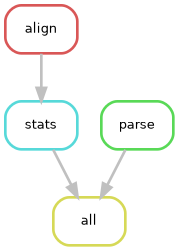

# 1. Dynamic Programming Edit Distance

### Complete Dynamic Programming matrix for the first sequence in the FASTA file
```bash
=============================================================
DYNAMIC PROGRAMMING MATRIX FOR THE FIRST SEQUENCE
=============================================================
      -  A  A  G  t  t  a  a  g  a  t  a  a  a  a  a  c  a  a
 - |  0  1  2  3  4  5  6  7  8  9 10 11 12 13 14 15 16 17 18
 A |  1  0  1  2  3  4  5  6  7  8  9 10 11 12 13 14 15 16 17
 A |  2  1  0  1  2  3  4  5  6  7  8  9 10 11 12 13 14 15 16
 G |  3  2  1  0  1  2  3  4  5  6  7  8  9 10 11 12 13 14 15
 t |  4  3  2  1  0  1  2  3  4  5  6  7  8  9 10 11 12 13 14
 t |  5  4  3  2  1  0  1  2  3  4  5  6  7  8  9 10 11 12 13
 a |  6  5  4  3  2  1  0  1  2  3  4  5  6  7  8  9 10 11 12
 a |  7  6  5  4  3  2  1  0  1  2  3  4  5  6  7  8  9 10 11
 g |  8  7  6  5  4  3  2  1  0  1  2  3  4  5  6  7  8  9 10
 a |  9  8  7  6  5  4  3  2  1  0  1  2  3  4  5  6  7  8  9
 t | 10  9  8  7  6  5  4  3  2  1  0  1  2  3  4  5  6  7  8
 a | 11 10  9  8  7  6  5  4  3  2  1  0  1  2  3  4  5  6  7
 a | 12 11 10  9  8  7  6  5  4  3  2  1  0  1  2  3  4  5  6
 a | 13 12 11 10  9  8  7  6  5  4  3  2  1  0  1  2  3  4  5
 a | 14 13 12 11 10  9  8  7  6  5  4  3  2  1  0  1  2  3  4
 a | 15 14 13 12 11 10  9  8  7  6  5  4  3  2  1  0  1  2  3
 c | 16 15 14 13 12 11 10  9  8  7  6  5  4  3  2  1  0  1  2
 a | 17 16 15 14 13 12 11 10  9  8  7  6  5  4  3  2  1  0  1
 a | 18 17 16 15 14 13 12 11 10  9  8  7  6  5  4  3  2  1  0
=============================================================
```

### What each cell $M(i,j)$ represents?
Each cell $M(i,j)$ represents the minimum edit distance required to transform the first $i$ characters of the reference sequence (pattern[0:i]) into the first $j$ characters of the target sequence (text[0:j]). Finally, it stores the optimal solution to each smaller subproblem.

### Why Dynamic Programming avoids the repeated computations that appear in a brute-force recursive solution?
In a recursive brute-force solution (top-down without memory), the algorithm recalculates the distance between the same sequence fragments over and over again, resulting in exponential runtime. Dynamic Programming, using tabulation (bottom-up), solves each subproblem only once and stores the result in the matrix. When it needs that value to calculate larger alignments, it simply retrieves it from memory, avoiding redundant work.

### Why the time complexity of this tabulation algorithm is $O(n \cdot m)$?
The algorithm consists of filling in a matrix of dimensions $(n+1) \times (m+1)$. To calculate the value of each individual cell, the algorithm performs a constant number of operations, $O(1)$: checking for character matches and finding the minimum among three adjacent values (diagonally, above, and to the left). Since $O(1)$ operations are performed for each of the $n \cdot m$ cells, the total time complexity is strictly proportional to the area of the matrix, that is, $O(n\cdot m)$.

# 2. Regular Expressions Analysis of CIGAR Strings

### Why Regular Expressions are useful for extracting information from CIGAR strings and other bioinformatis file formats?
Bioinformatics formats such as CIGAR strings condense complex information about sequence alignments into text strings by combining letters that represent operations. Regular expressions provide a declarative, fast, and very powerful language for searching for, isolating, and counting specific patterns within these strings without the need to program complex manual iterative loops.

# 3. Conda Environment

### Which command creates the environment?

```bash
conda create -n hpdc_env python=3 snakemake -c bioconda -c conda-forge -y
```
The `-c` flag defines the channels where the packages can be found.

The `-y` flag automatically answers “yes” to any confirmation prompts that appear during the installation process.

### Which command activates the environment?
```bash
conda activate hpdc_env
```

### Which command exports the environment?
```bash
conda env export > environment.yml
```
With only one `>` instead of two `>>`, the command overwrites an existing file, if it exists (if not, it creates a new file).

This file will only be compatible with machines running the same operating system as the original machine (Linux) because it also exports the binary compilation code, which depends on the processor architecture and operating system. Appart from that, Snakemake is only available for Linux/macOS.

### Why is an environment file useful for reproducibility?
An environment file is essential for reproducibility because it guarantees that an analysis can be executed on different computers and at different times with the exact same software configuration. Without it, using different versions of Python or software packages could lead to inconsistent results or executions failures. By tracking the packages versions used and sharing this file, any user can recreate the isolated software environment perfectly, ensuring the workflow runs exactly as intended.

### Which packages were included in your environment?
Only the python=3 and snakemake packages were included.

### Why these packages are required for the workflow?

- **Python 3** is the base interpreter required to run all the analysis scripts (parse_fasta.py, alignment.py, cigar_stats.py), which includes `sys` and `re` (regex) libraries.

- **Snakemake** is the workflow manager required to link scripts, manage their dependencies, and automate the execution of the pipeline in a reproducible manner.

### How another user could recreate your environment usin the exported `environment.yml` file?
Any other user who receives the environment.yml file simply needs to have Conda installed and run the following command in their terminal:

```bash
conda env create -f environment.yml
```

This will read the exact dependencies and versions and automatically build an identical environment.


# 4. Workflow Automation with Snakemake

### Output of `snakemake -n`

```bash
(hpdc_env) david@PC-SOBREMESA:~/URV/Q2/HPDC/Assignment3$ snakemake -n

SNAKEMAKE
=========
  Date: 2026-06-14 23:27:27
  Workflow ID: 5cf213e5-5d62-45d9-8051-7d39be2776c9
  Platform: Linux-6.6.87.2-microsoft-standard-WSL2-x86_64-with-glibc2.39
  Host: PC-SOBREMESA
  User: david
  Snakemake version: 9.23.0
  Python version: 3.13.14 | packaged by conda-forge | (main, Jun 12 2026, 09:50:25) [GCC 14.3.0]
  Command: /home/david/miniconda3/envs/hpdc_env/bin/snakemake -n
  Snakefile: /home/david/URV/Q2/HPDC/Assignment3/Snakefile
  Base directory: /home/david/URV/Q2/HPDC/Assignment3
  Run directory: /home/david/URV/Q2/HPDC/Assignment3
  Working directory: /home/david/URV/Q2/HPDC/Assignment3
  Config file(s): []
  Config MD5: 99914b932bd37a50b983c5e7c90ae93b

Building DAG of jobs...
Nothing to be done (all requested files are present and up to date).
2 jobs have missing provenance/metadata so that it in part cannot be used to trigger re-runs.
Rules with missing metadata: align stats
```

### Generated workflow DAG.


### What each rule does?

- **rule all:** This is the target rule of the workflow. It does not execute any command itself, but defines the final expected output files. Snakemake uses this rule to calculate the dependency graph and trigger all necessary previous steps.

- **rule parse:** Reads the raw PM_50.fasta file and executes the parse_fasta.py script. It extracts the sequences, calculates their lengths, and outputs the results into sequences.tsv.

- **rule align:** Takes the PM_50.fasta file as input and runs the alignment.py script. It computes the edit distance using a Dynamic Programming matrix and outputs two files: distances.tsv and alignments.tsv (which contains the CIGAR strings).

- **rule stats:** Takes alignments.tsv as its input and executes the cigar_stats.py script. It uses regular expressions to count the alignment operations (M, I, D, X) and generates cigar_stats.tsv along with the final summary report.txt.

### Why Snakemake improves reproducibility compared with manually running each script?

Snakemake significantly improves reproducibility for several key reasons:

1. **Automation and Dependency Tracking:** It automatically determines the correct execution order using a Directed Acyclic Graph (DAG) based on input and output definitions. This eliminates human errors, such as running scripts in the wrong order or forgetting a step.

2. **Smart Execution:** It tracks file modification times. If a single input file or script is updated, Snakemake only re-runs the specific steps affected by that change, rather than running the entire pipeline from scratch, saving computational time.

3. **Executable Documentation:** The Snakefile serves as a clear, readable blueprint of the entire analysis. Any other researcher can understand exactly how raw data is transformed into final results and reproduce the exact same workflow with a single command (snakemake), regardless of the complexity of the underlying scripts.